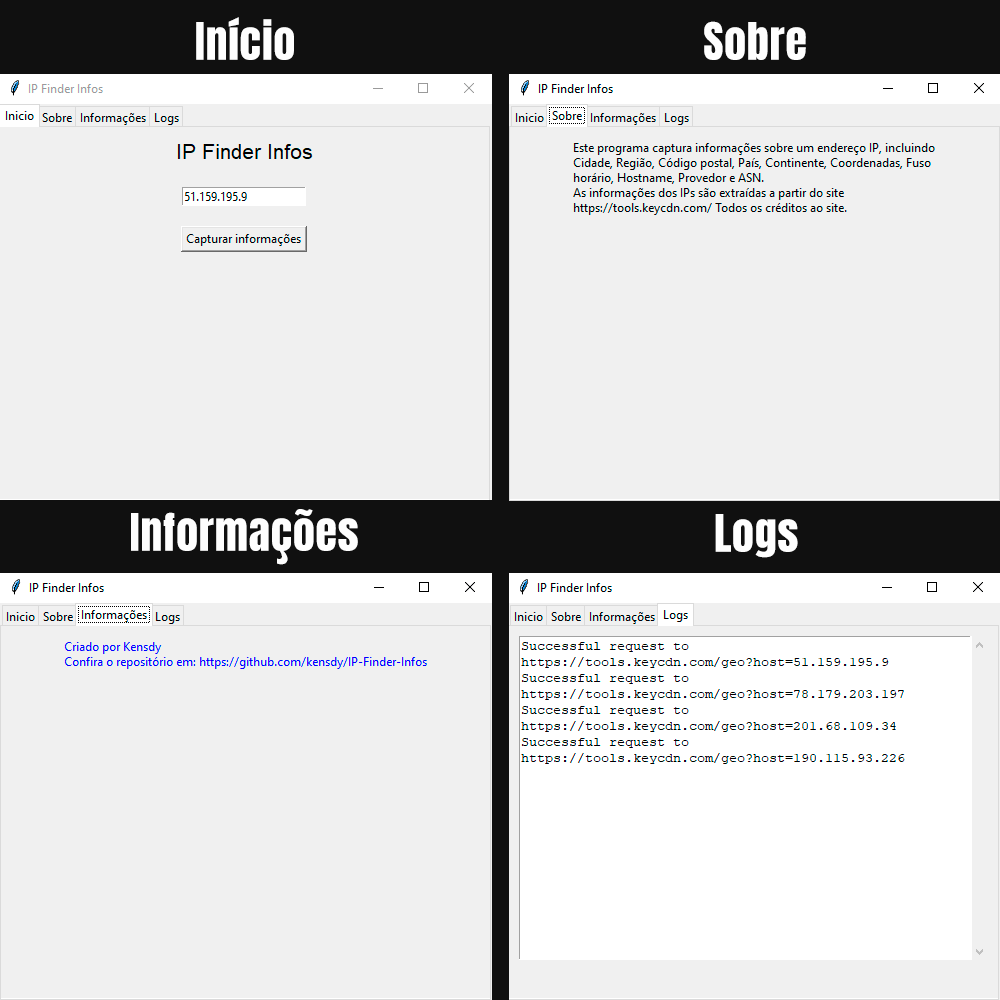
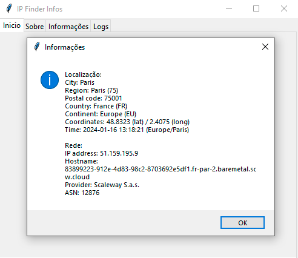

# IP-Finder-Infos

[English](README.md) | Português

Capture a partir de um IP: Cidade, Região, Código Postal, País, Continente, Coordenadas, Fuso Horário, Nome do Host, Provedor e ASN.

[]([https://github.com/kensdy/OSINT-Steam](https://github.com/kensdy/QR-Code-Generator))

## Como Instalar

1. Clone o repositório:

    ```bash
    git clone https://github.com/kensdy/IP-Finder-Infos.git
    ```

2. Navegue para o diretório do projeto:

    ```bash
    cd IP-Finder-Infos
    ```

3. Instale as dependências usando o `pip`:

    ```bash
    pip install -r requirements.txt
    ```
    
4. Execute o script principal:

    ```bash
    python main_pt.py
    ```
    
### Funcionalidades

- **Abas:**
  - **Inicio:** Insira o endereço IP no campo de entrada e clique no botão "Capturar informações" para obter detalhes.
  - **Sobre:** Fornece informações sobre o programa e créditos ao site de onde as informações são extraídas.
  - **Informações:** Oferece detalhes sobre o criador do programa e um link para o repositório no GitHub.
  - **Logs:** Exibe os logs do programa, incluindo informações sobre solicitações bem-sucedidas ou erros.
 
### Capturas de Tela

#### Abas



#### Resultados



### Contribuindo

Se você quiser contribuir para o projeto, sinta-se à vontade para criar pull requests ou abrir issues.

### Licença

Este projeto está licenciado sob a [Licença MIT](LICENSE).
